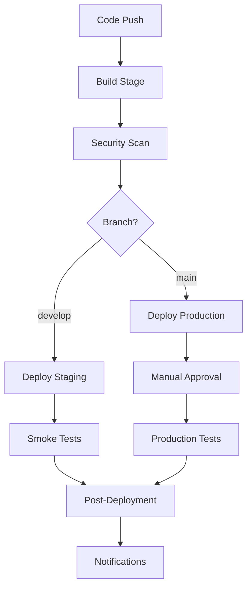

# Azure DevOps Pipeline for Flask + React Project

This repository contains a comprehensive Azure DevOps CI/CD pipeline for a Flask backend + React frontend application. The pipeline includes build, test, security scanning, and deployment stages with multiple environments.

## 🏗️ Pipeline Architecture

### Stages Overview
1. **Build Stage** - Compile, test, and build Docker images
2. **Security Stage** - Run security scans and vulnerability assessments
3. **Deploy Staging** - Deploy to staging environment (develop branch)
4. **Deploy Production** - Deploy to production environment (main branch)
5. **Post-Deployment** - Cleanup and notifications

### Key Features
- ✅ Multi-stage pipeline with parallel execution
- ✅ Docker containerization with multi-stage builds
- ✅ Comprehensive testing (unit, integration, coverage)
- ✅ Security scanning (Bandit, Safety, Semgrep, npm audit)
- ✅ Environment-specific deployments
- ✅ Manual approval gates for production
- ✅ Automated rollback capabilities
- ✅ Performance and smoke testing
- ✅ Monitoring and alerting integration

## 📁 Project Structure

```
├── azure-pipelines.yml              # Main pipeline definition
├── azure-pipelines-templates/       # Reusable pipeline templates
│   ├── build-template.yml
│   └── deploy-template.yml
├── azure-config/                    # Azure infrastructure configuration
│   ├── appsettings.json            # Environment-specific settings
│   └── arm-template.json           # Azure Resource Manager template
├── azure-devops/                    # Azure DevOps configuration
│   ├── variables.yml                # Pipeline variables
│   └── environments.yml             # Environment definitions
├── scripts/                         # Utility scripts
│   ├── production_tests.py          # Production testing script
│   └── deploy-azure-resources.sh    # Infrastructure deployment
├── backend/                         # Flask backend
│   ├── requirements.txt             # Production dependencies
│   ├── requirements-dev.txt         # Development dependencies
│   └── requirements-prod.txt        # Production-specific dependencies
├── frontend/                        # React frontend
│   └── package.json                 # Node.js dependencies
└── Dockerfile                       # Multi-stage Docker build
```

## 🚀 Quick Start

### Prerequisites
- Azure subscription
- Azure DevOps organization
- Azure Container Registry (ACR)
- Docker installed locally
- Azure CLI installed

### 1. Deploy Azure Infrastructure

```bash
# Make script executable
chmod +x scripts/deploy-azure-resources.sh

# Deploy infrastructure for development
./scripts/deploy-azure-resources.sh dev

# Deploy infrastructure for staging
./scripts/deploy-azure-resources.sh staging

# Deploy infrastructure for production
./scripts/deploy-azure-resources.sh prod
```

### 2. Configure Azure DevOps

1. **Create Service Connections:**
   - Azure Resource Manager connection
   - Azure Container Registry connection
   - Slack webhook (optional)

2. **Set Pipeline Variables:**
   - Copy variables from `azure-devops/variables.yml`
   - Update with your specific values
   - Mark sensitive variables as secret

3. **Create Environments:**
   - Import environment definitions from `azure-devops/environments.yml`
   - Configure approval gates
   - Set up health checks

### 3. Run the Pipeline

```bash
# Push to develop branch (triggers staging deployment)
git checkout develop
git push origin develop

# Push to main branch (triggers production deployment)
git checkout main
git push origin main
```

## 🔧 Configuration

### Environment Variables

| Variable | Description | Example |
|----------|-------------|---------|
| `azureSubscription` | Azure subscription name | `your-azure-subscription` |
| `resourceGroupName` | Azure resource group | `flask-react-rg` |
| `webAppName` | Azure App Service name | `flask-react-app` |
| `containerRegistry` | Azure Container Registry | `your-acr` |
| `dockerRegistry` | Container registry URL | `your-acr.azurecr.io` |
| `imageRepository` | Docker image repository | `flask-react-app` |

### Security Configuration

The pipeline includes comprehensive security scanning:

- **Python Security:**
  - Bandit (static analysis)
  - Safety (vulnerability scanning)
  - Semgrep (semantic analysis)

- **JavaScript Security:**
  - npm audit (dependency vulnerabilities)
  - ESLint security rules

- **Container Security:**
  - Docker image scanning
  - Base image vulnerability checks

### Monitoring Integration

- **Application Insights** for application monitoring
- **Azure Monitor** for infrastructure metrics
- **Custom health checks** for deployment validation
- **Slack notifications** for deployment status

## 🏭 Deployment Environments

### Development Environment
- **Trigger:** Push to `develop` branch
- **Approval:** Automatic
- **URL:** `https://flask-react-app-dev.azurewebsites.net`
- **Features:** Debug mode enabled, detailed logging

### Staging Environment
- **Trigger:** Push to `develop` branch
- **Approval:** Manual (QA team)
- **URL:** `https://flask-react-app-staging.azurewebsites.net`
- **Features:** Production-like configuration, smoke tests

### Production Environment
- **Trigger:** Push to `main` branch
- **Approval:** Manual (DevOps + Tech Lead)
- **URL:** `https://flask-react-app-prod.azurewebsites.net`
- **Features:** Full monitoring, performance tests, security scans

## 🧪 Testing Strategy

### Build Stage Tests
- **Unit Tests:** Python pytest + React Jest
- **Integration Tests:** API endpoint testing
- **Code Coverage:** Minimum 80% coverage required
- **Linting:** Code quality checks

### Security Tests
- **Static Analysis:** Bandit, ESLint security rules
- **Dependency Scanning:** Safety, npm audit
- **Container Scanning:** Docker image vulnerabilities

### Deployment Tests
- **Smoke Tests:** Basic health checks
- **Performance Tests:** Response time validation
- **Integration Tests:** End-to-end functionality

## 🔄 CI/CD Workflow



## 🛠️ Customization

### Adding New Environments

1. Update `azure-devops/environments.yml`
2. Add environment variables in `azure-devops/variables.yml`
3. Update ARM template in `azure-config/arm-template.json`
4. Modify deployment script in `scripts/deploy-azure-resources.sh`

### Adding New Tests

1. **Backend Tests:** Add to `backend/tests/`
2. **Frontend Tests:** Add to `frontend/src/__tests__/`
3. **Integration Tests:** Add to `scripts/integration_tests.py`
4. **Performance Tests:** Add to `scripts/performance_tests.py`

### Custom Build Steps

1. Modify `azure-pipelines-templates/build-template.yml`
2. Add new tasks to the build template
3. Update the main pipeline to use the new template

## 📊 Monitoring and Alerts

### Application Metrics
- Response time
- Error rate
- Throughput
- Resource utilization

### Infrastructure Metrics
- CPU usage
- Memory consumption
- Disk I/O
- Network traffic

### Alert Rules
- High error rate (>1% for production)
- High response time (>1000ms for production)
- Service availability
- Resource exhaustion

## 🚨 Troubleshooting

### Common Issues

1. **Build Failures:**
   - Check dependency versions
   - Verify environment variables
   - Review build logs

2. **Deployment Failures:**
   - Check Azure service connections
   - Verify resource group permissions
   - Review deployment logs

3. **Test Failures:**
   - Check test environment setup
   - Verify test data
   - Review test coverage requirements

### Debug Commands

```bash
# Check Azure CLI login
az account show

# List resource groups
az group list

# Check App Service status
az webapp show --name your-app --resource-group your-rg

# View deployment logs
az webapp log tail --name your-app --resource-group your-rg
```

## 📈 Performance Optimization

### Build Optimization
- Docker layer caching
- Parallel test execution
- Dependency caching
- Incremental builds

### Deployment Optimization
- Blue-green deployments
- Rolling updates
- Health check validation
- Automatic rollback

### Runtime Optimization
- Container resource limits
- Auto-scaling configuration
- CDN integration
- Database connection pooling

## 🔐 Security Best Practices

1. **Secrets Management:**
   - Use Azure Key Vault
   - Rotate secrets regularly
   - Limit access permissions

2. **Network Security:**
   - VNet integration
   - Private endpoints
   - Network security groups

3. **Container Security:**
   - Minimal base images
   - Regular security updates
   - Non-root user execution

4. **Application Security:**
   - Input validation
   - SQL injection prevention
   - XSS protection
   - CSRF tokens

## 📚 Additional Resources

- [Azure DevOps Documentation](https://docs.microsoft.com/en-us/azure/devops/)
- [Azure App Service Documentation](https://docs.microsoft.com/en-us/azure/app-service/)
- [Docker Best Practices](https://docs.docker.com/develop/dev-best-practices/)
- [Flask Deployment Guide](https://flask.palletsprojects.com/en/2.0.x/deploying/)
- [React Production Build](https://create-react-app.dev/docs/production-build/)

## 🤝 Contributing

1. Fork the repository
2. Create a feature branch
3. Make your changes
4. Add tests for new functionality
5. Update documentation
6. Submit a pull request

## 📄 License

This project is licensed under the MIT License - see the [LICENSE](LICENSE) file for details.

---

**Happy Deploying! 🚀**
